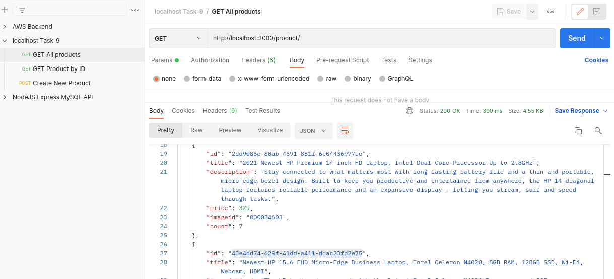
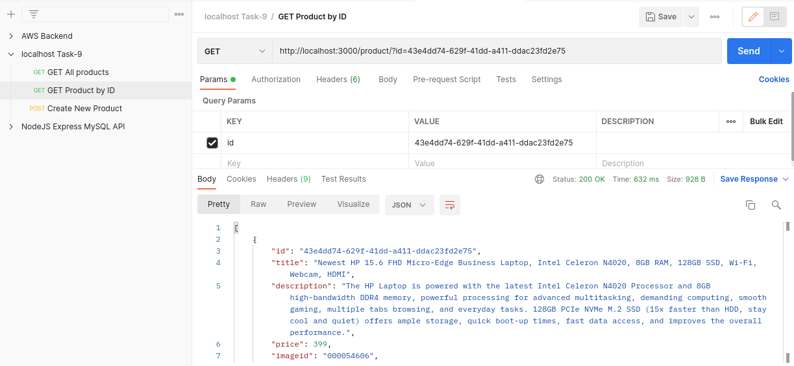
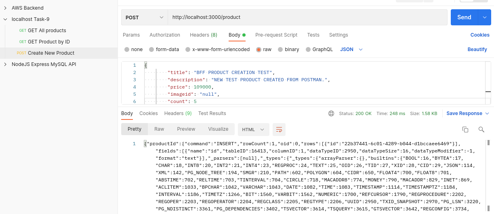

# __Task 9__

Task [description here](https://github.com/EPAM-JS-Competency-center/cloud-development-course-initial/blob/new-tasks/task9-bff-elastic-beanstalk/task.md)

Task due date / deadline date - 05.11.21 / 06.11.21 23:59(GMT+3)

Self check:
 
 TOTAL POINTS - _** 5 points**_
 
-----------
## __Evaluation criteria__

- [x] Cr.1: **3** - A working and correct **express** application should be in the **bff-service** folder. Reviewer can start this application locally with any valid configuration in the **.env** file and this application should works as described in the task 9.1
- [x] Cr.2: **5** - The **bff-service** should be deployed with Elastic Beanstalk. The **bff-service** call should be redirected to the appropriate service : **product-service** or **CART**. The response from the **bff-service** should be the same as if **product-service** or **CART** services were called directly.

## __Additional (optional) tasks__

- [x] Ad.1: **+1** - Add a cache at the **bff-service** level for a request to the **getProductsList** function of the **product-service**. The cache should expire in 2 minutes.  
- [x] Ad2.2: **+1** - Use **NestJS** to create **bff-service** instead of **express**

------------

# __Summary Report__

* FrontEnd: https://d3ph6tvz43noms.cloudfront.net/ 

Evaluation criteria   | Description | URL 
-------|--------------|-----
Cr.1 | Dockerfile is prepared (non-optimized) | https://github.com/SeLub/shop-aws-cart-api/blob/feat/nonopimized-deploy-from-registry/Dockerfiles/Dockerfile
Cr.2 | Dockerfile is optimized | https://github.com/SeLub/shop-aws-cart-api/blob/feat/deploy-from-registry/Dockerfiles/Dockerfile
Cr.3 | At least 2 big directories should be included in .dockerignore | https://github.com/SeLub/shop-aws-cart-api/blob/feat/deploy-from-registry/.dockerignore
Cr.4 | GitHub Cart API service | https://github.com/SeLub/shop-aws-cart-api
Cr.5 | A PR with updates in FE repository | https://github.com/SeLub/shop-aws-fe/pull/6/files
Cr.5 | A link from API PATH to api/profile/cart | http://selub-cart-api.eu-central-1.elasticbeanstalk.com/api/profile/cart

### API
Service | Method | URL | Action |
--------|--------|-----|--------|
product-service | GET | product | get Products List
product-service | GET | product/?id={id} | get Product By Id
product-service | POST | product | create Product

* product-service | DELETE | product/?id={id} | delete All Products
* product-service | PUT | product/?id={id} | update Products By Id
* product-service | DELETE | product | delete All Products

## Screenshots 

------------

#### **Express Server** -  получаем список всех товаров через **bff**

#### **Express Server** -  получаем товар по id через **bff**

#### **Express Server** -  создаём товар через **bff**

