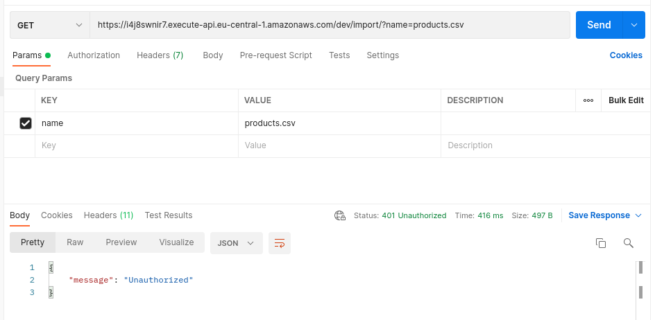
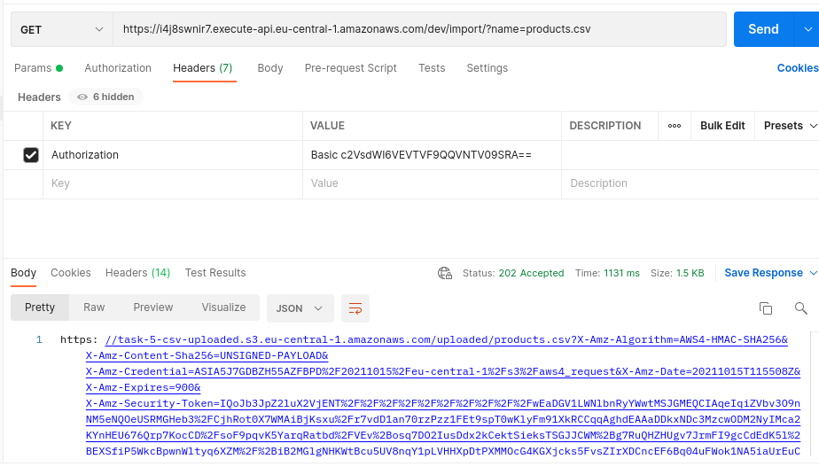
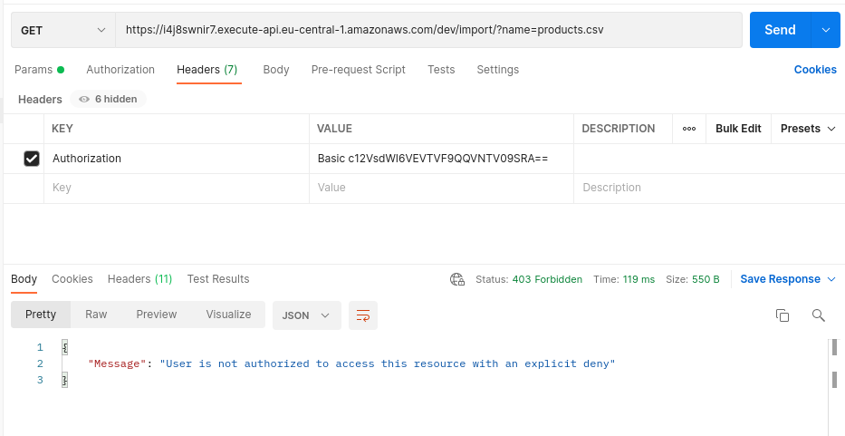
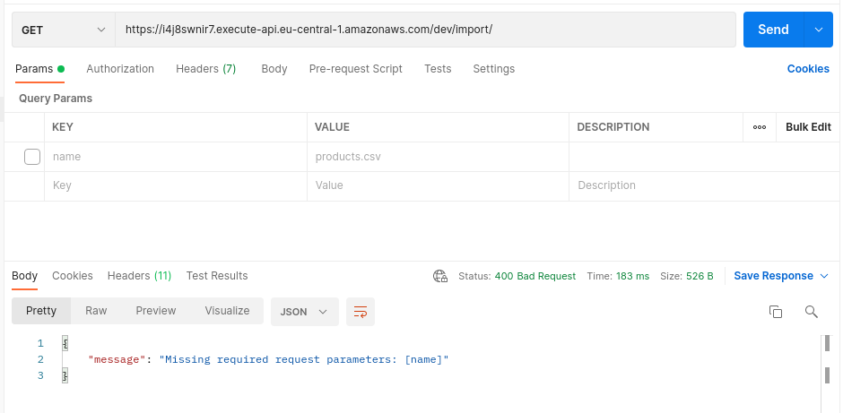
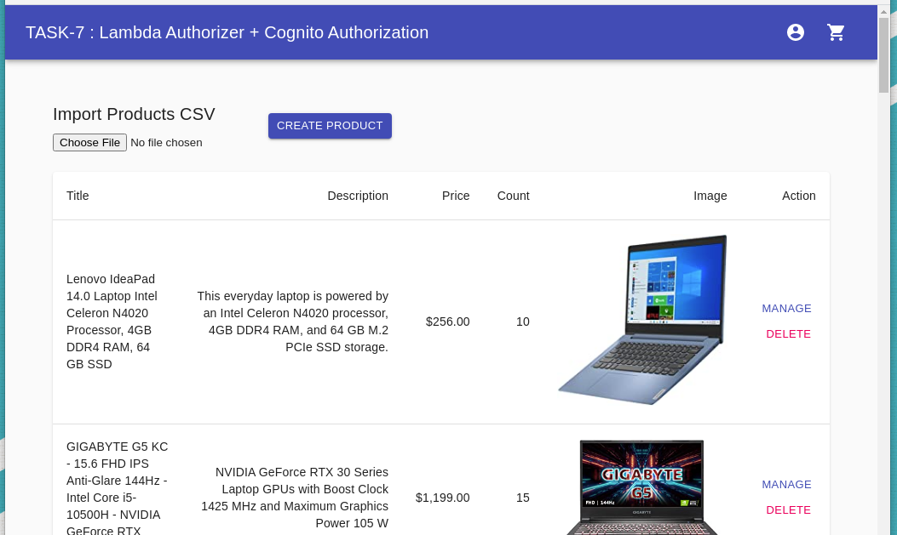

# __Task 8__

Task [description here](https://github.com/EPAM-JS-Competency-center/cloud-development-course-initial/blob/new-tasks/task8-cart-api-docker-elastic-beanstalk/task.md)

Task due date / deadline date - 25.10.21 / 25.10.21 23:59(GMT+3)

Self check:
 
 TOTAL POINTS - _** 6 points**_

 # Задание выполнено полностью. Импорт файла для создания товара закрыт Basic Авторизацией. Токен для загрузки берётся из localstorage. Вся инфраструктура создана при деплое, вручную ничего не настравается. Кроме того, в этом задании дополнительно к основному заданию реализована работа кнопок DELETE в административной части. Теперь можно не только создавать товары с помощью CSV файла, но и удалять не нужные после тестирования. Пожалуйста, НЕ УДАЛЯЙТЕ товары с картинками! Удаляйте тестовые товары с картинкой-заглушкой. Благодарю за понимание!
 
-----------
## __Evaluation criteria__

- [x] Cr.1: **1** - Dockerfile is prepared, image is building. Image size is minimised to be less than 500 MB.
- [x] Cr.2: **2** - Dockerfile is optimized. Files that change more often and commands that depend on them should be included later, files and commands that change less should be at the top.
- [x] Cr.3: **3** - Folders are added to .dockerignore, with explanations. At least 2 big directories should be excluded from build context. Elastic Beanstalk application is initialized.
- [x] Cr.4: **4** - Environment is created and the app is deployed to the AWS cloud. You must provide a link to your GitHub repo with Cart API service or PR with created Dockerfile and related configurations.
- [x] Cr.5: **5** - FE application is updated with Cart API endpoint. You must provide a PR with updates in your FE repository and OPTIONALLY link to deployed front-end app which makes proper API calls to your Cart service.

## __Additional (optional) tasks__

- [x] Ad.1: **+1** - Client application should display alerts for the responses in 401 and 403 HTTP statuses. This behavior should be added to the **nodejs-aws-fe-main/src/index.tsx** file

------------

# __Summary Report__

* FrontEnd: https://d3ph6tvz43noms.cloudfront.net/ 

Evaluation criteria   | Description | URL 
-------|--------------|-----
Cr.1 | **authorization-service** has correct **serverless.yaml** file | https://github.com/SeLub/shop-aws-be/blob/task-7/authorization-service/serverless.yml
Cr.1 | **authorization-service** has correct **basicAuthorizer** lambda | https://github.com/SeLub/shop-aws-be/blob/task-7/authorization-service/functions/basicAuthorizer/basicAuthorizer.js
Cr.2 | **import-service** serverless.yml file has authorizer configuration for the **importProductsFile** lambda. | https://github.com/SeLub/shop-aws-be/blob/task-7/import-service/serverless.yml
Cr.2 | For Full Report - Look at the Screenshots Section. | Link You can test by Postman. Valid Key: Authorization, Value: Basic c2VsdWI6VEVTVF9QQVNTV09SRA==  https://od70lpymy5.execute-api.eu-central-1.amazonaws.com/dev/import/?name=products.csv
Cr.5 | A PR with updates in your FE repository | https://github.com/SeLub/shop-aws-fe/pull/5/files
Cr.5 | A link to deployed front-end app which makes proper API calls to your Cart service | https://d3ph6tvz43noms.cloudfront.net/
Cr.5 | A link API PATH cart | http://selub-cart-api-dev2.eu-central-1.elasticbeanstalk.com/api

## Screenshots 

------------
#### **401 HTTP status - Unauthorized** -  не передан Authorization header 

#### **202 HTTP status - Accepted** - передан Authorization header с валидным Token

#### **403 HTTP status - Forbidden** - передан Authorization header с НЕ валидным Token.

#### **400 HTTP status - Bad Request** - передан Authorization header с валидным Token, но отсутствует обязательный параметр 'name'.

#### **DELETE BUTTON WORKS** - в этом задании дополнительно к косновнму заданю реализована работа кнопок DELETE в административной части. Теперь можно не только создавать товары с помощью CSV файла, но и удалять не нужные после тестирования.

