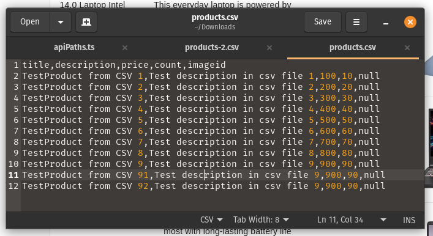
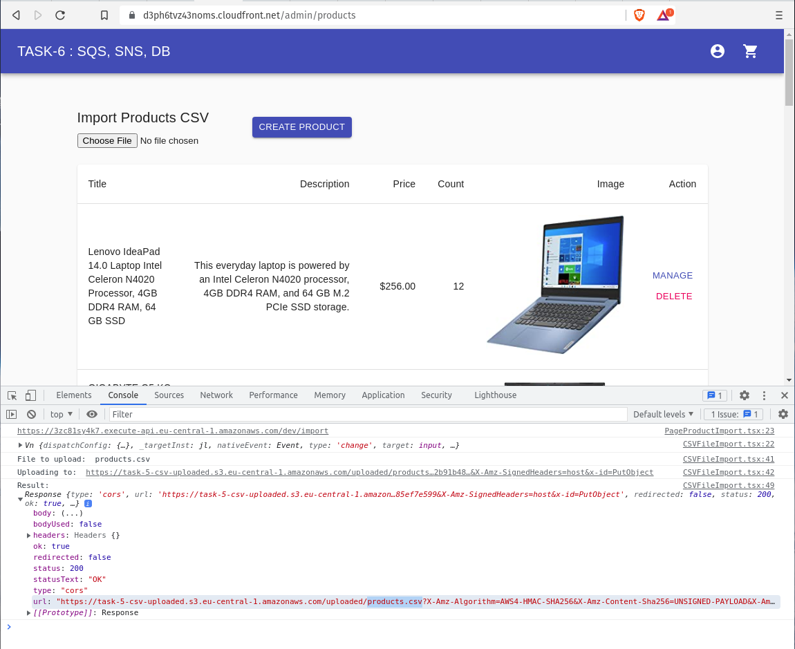
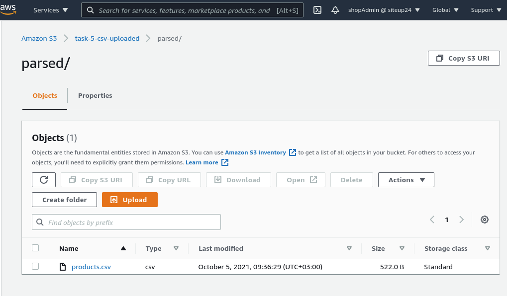
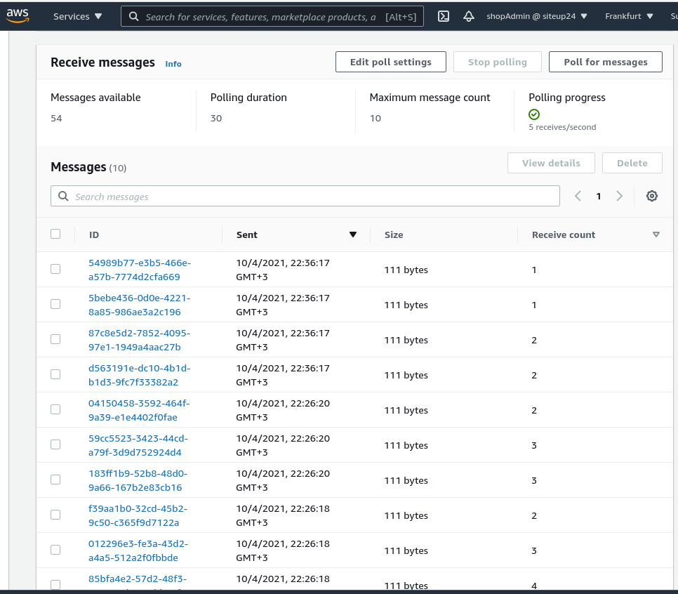
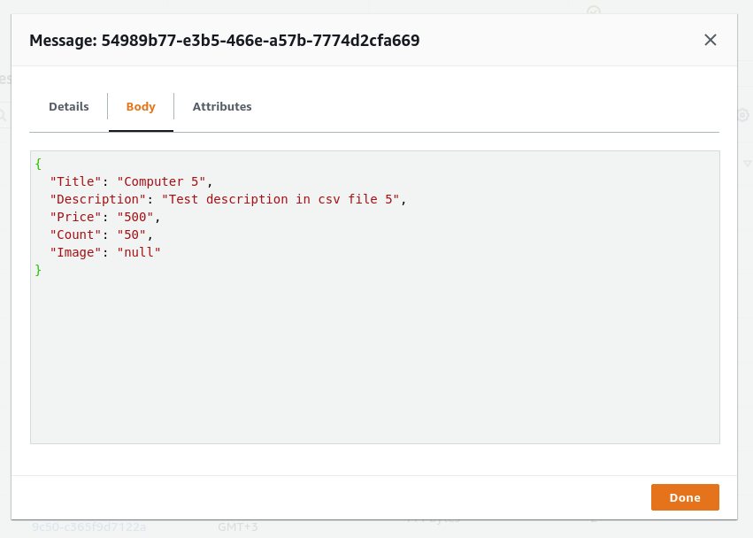
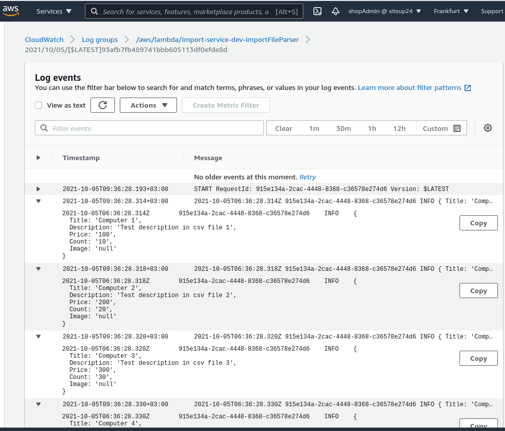
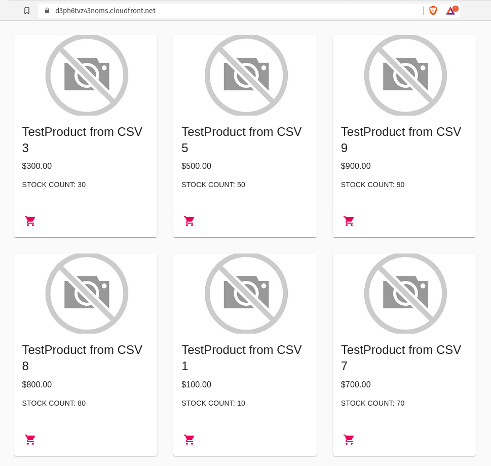
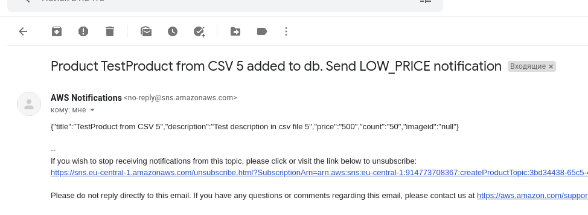

# __Task 6__

Task [description here](https://github.com/EPAM-JS-Competency-center/cloud-development-course-initial/blob/main/task6-async-services-integration-sqs-sns/task.md)

Task due date / deadline date - 04.10.21 / 04.10.21 23:59(GMT+3)

Self check:
 
 TOTAL POINTS - _** 6 points**_
 
-----------
## __Evaluation criteria__

- [x] Cr.1: **1** - File **serverless.yml** contains configuration for **catalogBatchProcess** function
- [x] Cr.2: **2** - File **serverless.yml** contains policies to allow lambda **catalogBatchProcess** function to interact with SNS and SQS
- [x] Cr.3: **3** - File **serverless.yml** contains configuration for SQS **catalogItemsQueue**
- [x] Cr.4: **4** - File **serverless.yml** contains configuration for SNS Topic **createProductTopic** and email subscription

## __Additional (optional) tasks__

- [x] Ad.1: +1 **(All languages)** - **catalogBatchProcess** lambda is covered by **unit** tests
- [x] Ad.2: +1 **(All languages)** - set a Filter Policy for SNS **createProductTopic** in **serverless.yml** (Create an additional email subscription and distribute messages to different emails depending on the filter for any product attribute)
------------

# __Summary Report__

* Link to **/product-service/serverless.yml** - https://github.com/SeLub/shop-aws-be/blob/task-6/product-service/serverless.yml
* Link to */import-service/serverless.yml*** - https://github.com/SeLub/shop-aws-be/blob/task-6/import-service/serverless.yml

Evaluation criteria   | Description | URL 
-------|--------------|-----
Cr.1 | File **serverless.yml** contains configuration for **catalogBatchProcess** function   | Lines 128-136 
Cr.2 | File **serverless.yml** contains policies to allow lambda **catalogBatchProcess** function to interact with SNS and SQS | Line 47 - 57
Cr.3 | File **serverless.yml** contains configuration for SQS **catalogItemsQueue** | Lines 39 - 40, 61 - 64
Cr.4 | File **serverless.yml** contains configuration for SNS Topic **createProductTopic** and email subscription | Lines 41 - 42, 66 - 91
Ad.1 | **catalogBatchProcess** lambda is covered by **unit** tests | https://github.com/SeLub/shop-aws-be/blob/task-6/product-service/functions/catalogBatchProcess/catalogBatchProcess.test.js
Ad.2 | set a Filter Policy for SNS **createProductTopic** in **serverless.yml** | Lines 78 - 80 and 89 - 91

## __BackEnd__

В Task-6 реализовано: 

* при деплоее автоматически создаётся S3 Bucket **task-5-csv-uploaded** и ему автоматически прописываются Сors. На данный момент Policy для бакета необходимо прописать вручную.
* лямбда **importFileParser**, загружает csv в S3 Bucket **task-5-csv-uploaded** и отсылает сообщения в SQS очередь **catalogItemsQueue**

* при деплоее автоматически создаётся SQS очередь **catalogItemsQueue**, которая является тригерром для лямбды **catalogBatchProcess**
* при деплоее автоматически создаётся лямбда **catalogBatchProcess**, которая получает сообщения из SQS очереди **catalogItemsQueue** до 5 штук за раз и сохраняет их в базе данных

* при деплоее автоматически создаётся SNS очередь **catalogItemsQueue**, которая отсылает сообщения на e-mail при парсинге товаров из csv, при этом происходит сортировка сообщений по цене. Цена равно 500$

* после загрузки csv файла создаются записи в базе данных
* **catalogBatchProcess** находится в сервисе **product-service** 

Структкра CSV- файла:

title,description,price,count,imageid
TestProduct from CSV 1,Test description in csv file 1,100,10,null 

Все эти задачи реализованы в рамках создания нового сервиса import-service в рамках
создания приложения микросервисной архитектуры.

## __FrontEnd__

Данные во FE отобраажаются от API, который в свою очередь берёт их из базы данных RDS AWS. Картинки хранятся в специально созданнном S3 Bucket. Для него настроен CloudFront. Для товара у которого нет картинки используется стандартная картинка-заглушка. Рядом с ценой каждого товара выводится остаток на складе (stock).

В админке реализовано: 
- выводится список товаров
- у каждого товара выводится изображение
- загрузка CSV файла со списком товаров на бэкед (в специально созданный S3 Bucket)
- исправлены "врождённые" ошибки (cart.tsx)

* FrontEnd: https://d3ph6tvz43noms.cloudfront.net/ 

## Screenshots 

------------
#### Файл CSV с данными товаров для вставки в базу данных.

#### Файл CSV с данными товаров загружен Фронтендом без ошибок в S3 бакет.

#### Файл CSV с данными в S3 бакете в папке parsed. Парсинг файла состоялся и на следующем скрине мы увидим результат.

#### Парсинг файла CSV состоялся и мы отправили записи из файла в очередь SQS.

#### Так выглядит единичная запись в очереде SQS.

#### Также записи выводим в CloudWatch.

#### Записи CloudWatch от catalogBatchProcess.

#### Созданные товары главной странице нашего сайта

#### Емайл для товара с ценой мене 500

## __Swagger documentation__

https://app.swaggerhub.com/apis/SeLub/AWSShopAPI/1.0.0