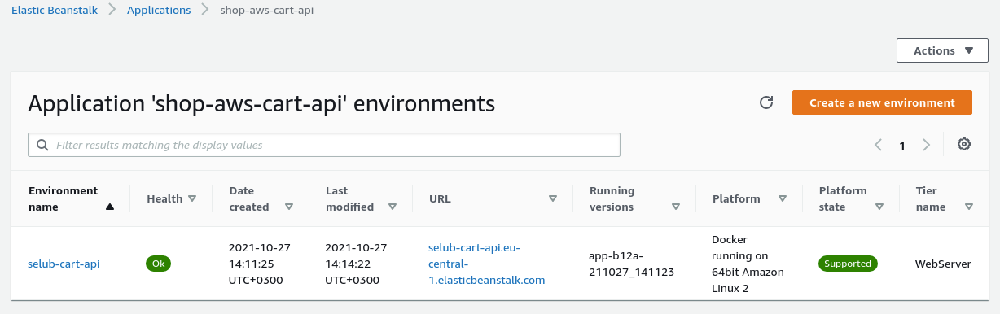
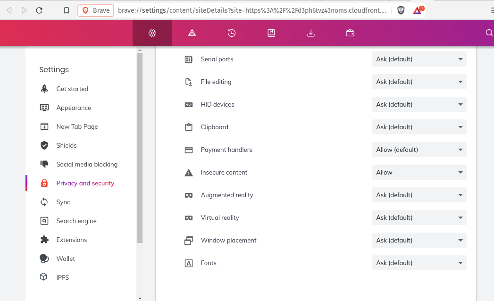
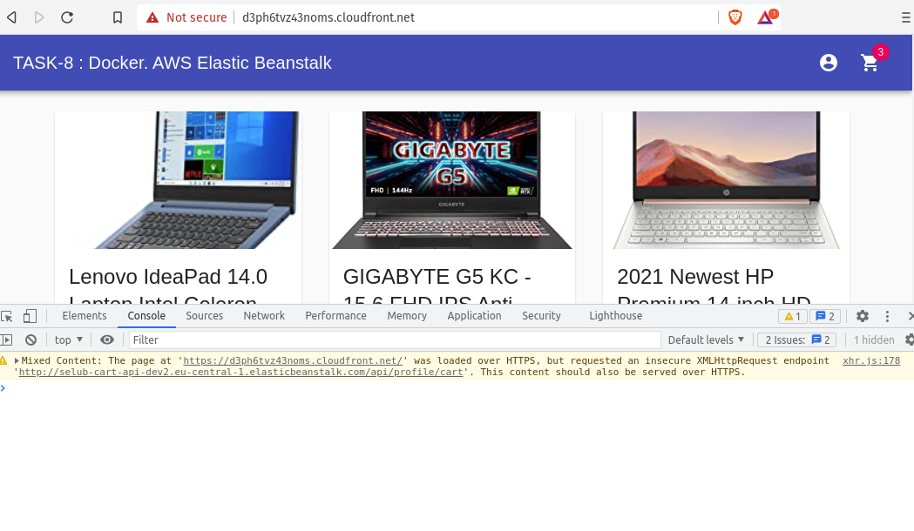

# __Task 8__

Task [description here](https://github.com/EPAM-JS-Competency-center/cloud-development-course-initial/blob/new-tasks/task8-cart-api-docker-elastic-beanstalk/task.md)

Task due date / deadline date - 25.10.21 / 25.10.21 23:59(GMT+3)

Self check:
 
 TOTAL POINTS - _** 5 points**_
 
-----------
## __Evaluation criteria__

- [x] Cr.1: **1** - Dockerfile is prepared, image is building. Image size is minimised to be less than 500 MB.
- [x] Cr.2: **2** - Dockerfile is optimized. Files that change more often and commands that depend on them should be included later, files and commands that change less should be at the top.
- [x] Cr.3: **3** - Folders are added to .dockerignore, with explanations. At least 2 big directories should be excluded from build context. Elastic Beanstalk application is initialized.
- [x] Cr.4: **4** - Environment is created and the app is deployed to the AWS cloud. You must provide a link to your GitHub repo with Cart API service or PR with created Dockerfile and related configurations.
- [x] Cr.5: **5** - FE application is updated with Cart API endpoint. You must provide a PR with updates in your FE repository and OPTIONALLY link to deployed front-end app which makes proper API calls to your Cart service.

------------

# __Summary Report__

* FrontEnd: https://d3ph6tvz43noms.cloudfront.net/ 

Evaluation criteria   | Description | URL 
-------|--------------|-----
Cr.1 | Dockerfile is prepared | https://github.com/SeLub/rs-cart-api/blob/simple-deploy/Dockerfile
Cr.2 | Dockerfile is optimized | https://github.com/SeLub/rs-cart-api/blob/simple-deploy/Dockerfile
Cr.4 | Folders are added to .dockerignore, with explanations. | https://github.com/SeLub/rs-cart-api/blob/simple-deploy/.gitignore
Cr.5 | A PR with updates in your FE repository | https://github.com/SeLub/shop-aws-fe/pull/6
Cr.5 | A front-end app which makes proper API calls to Cart service | https://d3ph6tvz43noms.cloudfront.net/
Cr.5 | A link from API PATH to api/profile/cart | http://selub-cart-api-dev2.eu-central-1.elasticbeanstalk.com/api/profile/cart

## Screenshots 

------------
#### **Elastic Beanstalk** -  задеплоил приложение

#### Настройки браузера Brave для проверки работы Cart API. Позволяет HTTP.

#### **Страница с товарами в корзине** - после обновления товары в корзине сохраняются.

