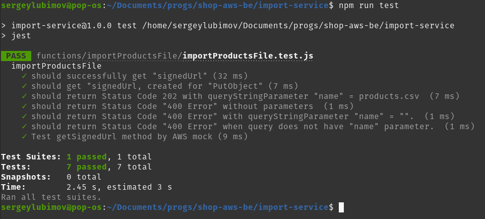

# __Task 6__

Task [description here](https://github.com/EPAM-JS-Competency-center/cloud-development-course-initial/blob/main/task6-async-services-integration-sqs-sns/task.md)

Task due date / deadline date - 04.10.21 / 04.10.21 23:59(GMT+3)

Self check:
 
 TOTAL POINTS - _** 6 points**_
 
-----------
## __Evaluation criteria__

- [x] Cr.1: **1** - File **serverless.yml** contains configuration for **catalogBatchProcess** function
- [x] Cr.2: **2** - File **serverless.yml** contains policies to allow lambda **catalogBatchProcess** function to interact with SNS and SQS
- [x] Cr.3: **3** - File **serverless.yml** contains configuration for SQS **catalogItemsQueue**
- [x] Cr.4: **4** - File **serverless.yml** contains configuration for SNS Topic **createProductTopic** and email subscription

## __Additional (optional) tasks__

- [x] Ad.1: +1 **(All languages)** - **catalogBatchProcess** lambda is covered by **unit** tests
- [x] Ad.2: +1 **(All languages)** - set a Filter Policy for SNS **createProductTopic** in **serverless.yml** (Create an additional email subscription and distribute messages to different emails depending on the filter for any product attribute)
------------

# __Summary Report__
Evaluation criteria   | Description | URL 
-------|--------------|-----
Cr.1 | File **serverless.yml** contains configuration for **catalogBatchProcess** function   | https://github.com/SeLub/shop-aws-be/blob/task-5/import-service/serverless.yml
Cr.2 | File **serverless.yml** contains policies to allow lambda **catalogBatchProcess** function to interact with SNS and SQS | https://pipwbmgctg.execute-api.eu-central-1.amazonaws.com/dev/import/?name=products.csv
Cr.3 | File **serverless.yml** contains configuration for SQS **catalogItemsQueue** | https://d3ph6tvz43noms.cloudfront.net/admin/products
Cr.4 | File **serverless.yml** contains configuration for SNS Topic **createProductTopic** and email subscription | https://github.com/SeLub/shop-aws-be/blob/task-5/import-service/functions/importFileParser/importFileParser.js
Ad.1 | **catalogBatchProcess** lambda is covered by **unit** tests | https://github.com/SeLub/shop-aws-be/blob/task-5/import-service/functions/importProductsFile/importProductsFile.js
Ad.2 | set a Filter Policy for SNS **createProductTopic** in **serverless.yml** | https://github.com/SeLub/shop-aws-be/blob/task-5/import-service/functions/importFileParser/importFileParser.js

## __FrontEnd__

```
Данные во FE отобраажаются от API, который в свою очередь берёт их из базы данных RDS AWS.
Картинки хранятся в специально созданнном S3 Bucket. Для него настроен CloudFront.
Рядом с ценой каждого товара выводится остаток на складе (stock).
Для товара у которого нет картинки используется стандартная картинка-заглушка.

В админке реализовано: 
- выводится список товаров
- загрузка CSV файла со списком товаров на бэкед (в специально созданный S3 Bucket).

```

* FrontEnd: https://d3ph6tvz43noms.cloudfront.net/ 

## __BackEnd__

```
В Task-6 реализовано: 

- 

- 

- 

- 

Все эти задачи реализованы в рамках создания нового сервиса import-service в рамках
создания приложения микросервисной архитектуры.

```

## Screenshots 

------------

### Frontend


### CloudWatch


### Tests



## __Swagger documentation__

https://app.swaggerhub.com/apis/SeLub/AWSShopAPI/1.0.0
